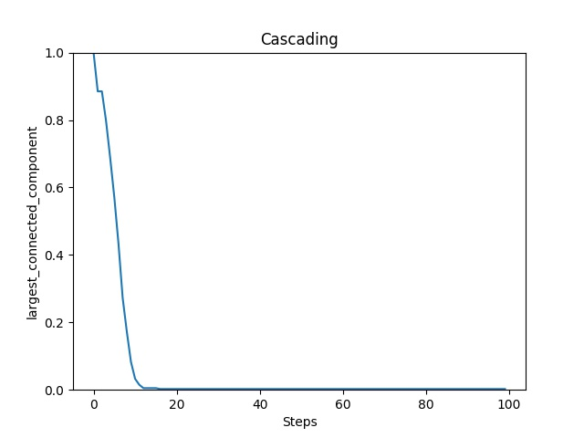
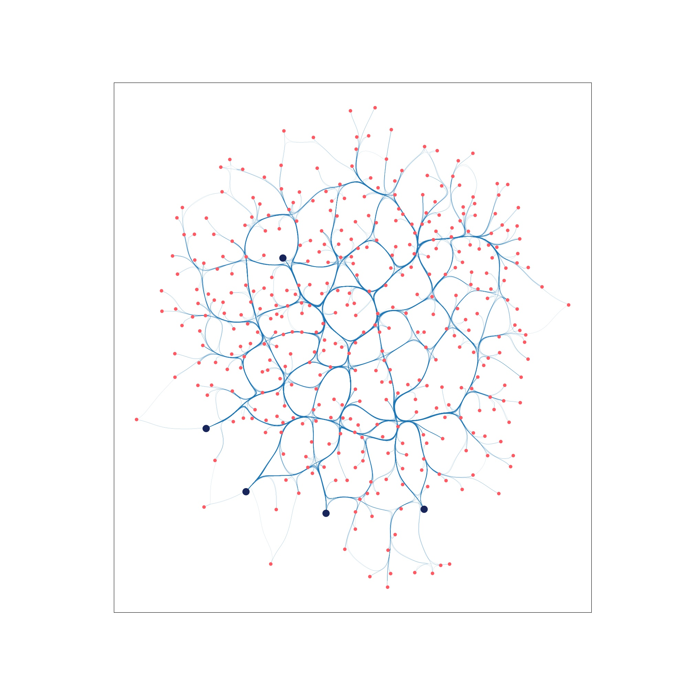
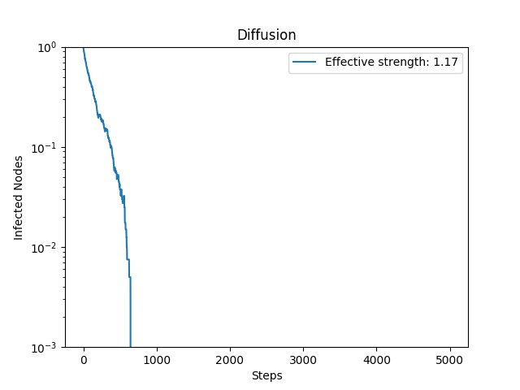

[](https://github.com/safreita1/TIGER/actions/workflows/ci.yml)

[](https://www.python.org/downloads/release/python-360/)
[](https://www.python.org/downloads/release/python-360/)
[](https://graph-tiger.readthedocs.io/en/latest/?badge=latest)
[](https://opensource.org/licenses/MIT)
[](https://arxiv.org/pdf/2006.05648.pdf)


**TIGER** is a Python toolbox to conduct graph vulnerability and robustness research. TIGER contains numerous 
state-of-the-art methods to help users conduct graph vulnerability and robustness analysis on graph structured data.
Specifically, TIGER helps users: 

1. **Quantify** network *vulnerability* and *robustness*, 
2. **Simulate** a variety of network attacks, cascading failures and spread of dissemination of entities
3. **Augment** a network's structure to resist *attacks* and recover from *failure* 
4. **Regulate** the dissemination of entities on a network (e.g., viruses, propaganda). 

<!---TIGER contains a wide range of techniques across conferences and journals in data mining ([ICDM](http://icdm.bigke.org/), 
[CIKM](http://www.cikmconference.org/), [SDM](https://www.siam.org/conferences/cm/conference/sdm21), [DMKD](https://www.springer.com/journal/10618)), 
and the natural sciences ([Physica A](https://www.journals.elsevier.com/physica-a-statistical-mechanics-and-its-applications), 
[Physical Review E](https://journals.aps.org/pre/), [EPJ](https://www.epj.org/)). 
-->

For additional information, take a look at the **[Documentation](https://graph-tiger.readthedocs.io/)** and our paper:

[**Evaluating Graph Vulnerability and Robustness using TIGER**](https://arxiv.org/pdf/2006.05648.pdf).
[**Scott Freitas**](https://scottfreitas.com), Diyi Yang, Srijan Kumar, Hanghang Tong, and Duen Horng (Polo) Chau.
*CIKM Resource Track, 2021.*

--------------------------------------------------------------------------------

### Setup
To quickly get started, install TIGER using pip

```sh
$ pip install graph-tiger
``` 

Alternatively, you can clone [TIGER](https://github.com/safreita1/TIGER.git), create a new Anaconda environment,
and install the library by running ```python setup.py install```.

To verify that everything works as expected, you can run the tests cases using ```python -m pytest tests/```.

--------------------------------------------------------------------------------

### Tutorials
We provide 5 in-depth tutorials in the **[Documentation](https://graph-tiger.readthedocs.io/)**, each covers a core aspect of TIGER's functionality.

**Tutorial 1: [Measuring Graph Vulnerability and Robustness](https://graph-tiger.readthedocs.io/en/latest/tutorials/tutorial-1.html)** 

**Tutorial 2: [Attacking a Network](https://graph-tiger.readthedocs.io/en/latest/tutorials/tutorial-2.html)** 

**Tutorial 3: [Defending A Network](https://graph-tiger.readthedocs.io/en/latest/tutorials/tutorial-3.html)** 

**Tutorial 4: [Simulating Cascading Failures on Networks](https://graph-tiger.readthedocs.io/en/latest/tutorials/tutorial-4.html)** 

**Tutorial 5: [Simulating Entity Dissemination on Networks](https://graph-tiger.readthedocs.io/en/latest/tutorials/tutorial-5.html)** 

--------------------------------------------------------------------------------

### Citing

If you find *TIGER* useful in your research, please consider citing the following paper:

```bibtex
@article{freitas2021evaluating,
    title={Evaluating Graph Vulnerability and Robustness using TIGER},
    author={Freitas, Scott and Yang, Diyi and Kumar, Srijan and Tong, Hanghang and Chau, Duen Horng},
    journal={ACM International Conference on Information and Knowledge Management},
    year={2021}
}
```

--------------------------------------------------------------------------------


### Quick Examples

#### EX 1. Calculate graph robustness (e.g., spectral radius, effective resistance)
    from graph_tiger.measures import run_measure
    from graph_tiger.graphs import graph_loader
    
    graph = graph_loader(graph_type='BA', n=1000, seed=1)
    
    spectral_radius = run_measure(graph, measure='spectral_radius')
    print("Spectral radius:", spectral_radius)
    
    effective_resistance = run_measure(graph, measure='effective_resistance')
    print("Effective resistance:", effective_resistance)
        
    

### EX 2. Run a cascading failure simulation on a Barabasi Albert graph
    from graph_tiger.cascading import Cascading
    from graph_tiger.graphs import graph_loader
    
    graph = graph_loader('BA', n=400, seed=1)
    
    params = {
        'runs': 1,
        'steps': 100,
        'seed': 1,

        'l': 0.8,
        'r': 0.2,
        'c': int(0.1 * len(graph)),
    
        'k_a': 30,
        'attack': 'rb_node',
        'attack_approx': int(0.1 * len(graph)),
    
        'k_d': 0,
        'defense': None,
    
        'robust_measure': 'largest_connected_component',
    
        'plot_transition': True,  # False turns off key simulation image "snapshots"
        'gif_animation': False,  # True creaets a video of the simulation (MP4 file)
        'gif_snaps': False,  # True saves each frame of the simulation as an image
    
        'edge_style': 'bundled',
        'node_style': 'force_atlas',
        'fa_iter': 2000,
    }
    
    cascading = Cascading(graph, **params)
    results = cascading.run_simulation()
    
    cascading.plot_results(results)
    
Step 0: Network pre-attack | Step 6: Beginning of cascading failure | Step 99: Collapse of network
:-------------------------:|:-------------------------:|:-------------------------:
  |    |  
    
    
[comment]: 
    
### EX 3. Run an SIS virus simulation on a Barabasi Albert graph
    from graph_tiger.diffusion import Diffusion
    from graph_tiger.graphs import graph_loader
    
    graph = graph_loader('BA', n=400, seed=1)
    
    
    sis_params = {
        'model': 'SIS',
        'b': 0.001,
        'd': 0.01,
        'c': 1,
    
        'runs': 1,
        'steps': 5000,
        'seed': 1,
    
        'diffusion': 'min',
        'method': 'ns_node',
        'k': 5,
    
        'plot_transition': True,
        'gif_animation': False,
    
        'edge_style': 'bundled',
        'node_style': 'force_atlas',
        'fa_iter': 2000
    }
    
    diffusion = Diffusion(graph, **sis_params)
    results = diffusion.run_simulation()
    
    diffusion.plot_results(results)
    
    
Step 0: Virus infected network |Step 80: Partially infected network | Step 4999: Virus contained
:-------------------------:|:-------------------------:|:-------------------------:
  |  |  

[comment]: 

--------------------------------------------------------------------------------

### Techniques Implemented

**Vulnerability and Robustness Measures:**

* **[Vertex Connectivity](https://graph-tiger.readthedocs.io/en/latest/measures.html#graph_tiger.measures.node_connectivity)** 
<br> Ellens *et al.* [Graph measures and network robustness](https://arxiv.org/pdf/1311.5064.pdf) (arXiv 2013)
* **[Edge Connectivity](https://graph-tiger.readthedocs.io/en/latest/measures.html#graph_tiger.measures.edge_connectivity)** 
<br> Ellens *et al.* [Graph measures and network robustness](https://arxiv.org/pdf/1311.5064.pdf) (arXiv 2013)
* **[Diameter](https://graph-tiger.readthedocs.io/en/latest/measures.html#graph_tiger.measures.diameter)** 
<br> Ellens *et al.* [Graph measures and network robustness](https://arxiv.org/pdf/1311.5064.pdf) (arXiv 2013)
* **[Average Distance](https://graph-tiger.readthedocs.io/en/latest/measures.html#graph_tiger.measures.avg_distance)** 
<br> Ellens *et al.* [Graph measures and network robustness](https://arxiv.org/pdf/1311.5064.pdf) (arXiv 2013)
* **[Average Inverse Distance (Efficiency)](https://graph-tiger.readthedocs.io/en/latest/measures.html#graph_tiger.measures.avg_inverse_distance)** 
<br> Ellens *et al.* [Graph measures and network robustness](https://arxiv.org/pdf/1311.5064.pdf) (arXiv 2013) 
* **[Average Vertex Betweenness](https://graph-tiger.readthedocs.io/en/latest/measures.html#graph_tiger.measures.avg_vertex_betweenness)** 
<br> Ellens *et al.* [Graph measures and network robustness](https://arxiv.org/pdf/1311.5064.pdf) (arXiv 2013)
* **[Approximate Average Vertex Betweenness](https://graph-tiger.readthedocs.io/en/latest/measures.html#graph_tiger.measures.avg_vertex_betweenness)** 
<br> Brandes *et al.* [Centrality Estimation in Large Networks](https://www.worldscientific.com/doi/10.1142/S0218127407018403) (International Journal of Bifurcation and Chaos 2007)
* **[Average Edge Betweenness](https://graph-tiger.readthedocs.io/en/latest/measures.html#graph_tiger.measures.avg_edge_betweenness)** 
<br> Ellens *et al.* [Graph measures and network robustness](https://arxiv.org/pdf/1311.5064.pdf) (arXiv 2013)
* **[Approximate Average Edge Betweenness](https://graph-tiger.readthedocs.io/en/latest/measures.html#graph_tiger.measures.avg_edge_betweenness)** 
<br> Brandes *et al.* [Centrality Estimation in Large Networks](https://www.worldscientific.com/doi/10.1142/S0218127407018403) (International Journal of Bifurcation and Chaos 2007)
* **[Average Clustering Coefficient](https://graph-tiger.readthedocs.io/en/latest/measures.html#graph_tiger.measures.average_clustering_coefficient)**
* **[Largest Connected Component](https://graph-tiger.readthedocs.io/en/latest/measures.html#graph_tiger.measures.largest_connected_component)**
* **[Spectral Radius](https://graph-tiger.readthedocs.io/en/latest/measures.html#graph_tiger.measures.spectral_radius)** (**GPU Accelerated: :heavy_check_mark:**)
<br> Tong *et al.* [On the Vulnerability of Large Graphs](http://people.seas.harvard.edu/~babis/netshield-icdm10.pdf) (ICDM 2010)
* **[Spectral Gap](https://graph-tiger.readthedocs.io/en/latest/measures.html#graph_tiger.measures.spectral_gap)** (**GPU Accelerated: :heavy_check_mark:**)
<br> Estrada [Network robustness to targeted attacks. The interplay of expansibility and degree distribution](https://link.springer.com/article/10.1140/epjb/e2006-00330-7) (European Physical Journal B 2006)
* **[Natural Connectivity](https://graph-tiger.readthedocs.io/en/latest/measures.html#graph_tiger.measures.natural_connectivity)** (**GPU Accelerated: :heavy_check_mark:**)
<br> Jun *et al.* [Natural connectivity of complex networks](https://iopscience.iop.org/article/10.1088/0256-307X/27/7/078902) (Chinese Physics Letters 2010)
* **[Approximate Natural Connectivity](https://graph-tiger.readthedocs.io/en/latest/measures.html#graph_tiger.measures.natural_connectivity)** (**GPU Accelerated: :heavy_check_mark:**)
* **[Spectral Scaling](https://graph-tiger.readthedocs.io/en/latest/measures.html#graph_tiger.measures.spectral_scaling)** (**GPU Accelerated: :heavy_check_mark:**)
<br> Estrada [Network robustness to targeted attacks. The interplay of expansibility and degree distribution](https://link.springer.com/article/10.1140/epjb/e2006-00330-7) (European Physical Journal B 2006)
* **[Generalized Robustness Index](https://graph-tiger.readthedocs.io/en/latest/measures.html#graph_tiger.measures.generalized_robustness_index)** (**GPU Accelerated: :heavy_check_mark:**)
<br> Malliaros *et al.* [Fast Robustness Estimation in Large Social Graphs: Communities and Anomaly Detection](https://epubs.siam.org/doi/10.1137/1.9781611972825.81) (SDM 2012)
* **[Algebraic Connectivity](https://graph-tiger.readthedocs.io/en/latest/measures.html#graph_tiger.measures.algebraic_connectivity)** 
<br> Chan *et al.* [Optimizing network robustness by edge rewiring: a general framework](https://link.springer.com/article/10.1007/s10618-015-0447-5) (DMKD 2016)
* **[Number of Spanning Trees](https://graph-tiger.readthedocs.io/en/latest/measures.html#graph_tiger.measures.num_spanning_trees)** 
<br> Baras *et al.* [Efficient and robust communication topologies for distributed decision making in networked systems]() (CDC 2009)
* **[Approximate Number of Spanning Trees](https://graph-tiger.readthedocs.io/en/latest/measures.html#graph_tiger.measures.num_spanning_trees)**
* **[Effective Resistance](https://graph-tiger.readthedocs.io/en/latest/measures.html#graph_tiger.measures.effective_resistance)** 
<br> Klein [Resistance distance](https://link.springer.com/article/10.1007/BF01164627) (Journal of Mathematical Chemistry 1993)
* **[Approximate Effective Resistance](https://graph-tiger.readthedocs.io/en/latest/measures.html#graph_tiger.measures.effective_resistance)**


**Attack Strategies:**
* **[Remove Node: Netshield](https://graph-tiger.readthedocs.io/en/latest/attacks.html#graph_tiger.attacks.get_node_ns)** 
<br> Tong *et al.* [On the Vulnerability of Large Graphs](http://people.seas.harvard.edu/~babis/netshield-icdm10.pdf) (ICDM 2010)
* **[Remove Node: PageRank](https://graph-tiger.readthedocs.io/en/latest/attacks.html#graph_tiger.attacks.get_node_pr)** 
<br> Page *et al.* [The PageRank Citation Ranking: Bringing Order to the Web](http://ilpubs.stanford.edu:8090/422/1/1999-66.pdf)
* **[Remove Node: Eigenvector Centrality](https://graph-tiger.readthedocs.io/en/latest/attacks.html#graph_tiger.attacks.get_node_eig)** 
<br> Holme *et al.* [Attack vulnerability of complex networks](https://journals.aps.org/pre/abstract/10.1103/PhysRevE.65.056109) (Physical Review E 2002)
* **[Remove Node: Initial Degree (ID)](https://graph-tiger.readthedocs.io/en/latest/attacks.html#graph_tiger.attacks.get_node_id)** 
<br> Holme *et al.* [Attack vulnerability of complex networks](https://journals.aps.org/pre/abstract/10.1103/PhysRevE.65.056109) (Physical Review E 2002)
* **[Remove Node: Recalculated Degree (RD)](https://graph-tiger.readthedocs.io/en/latest/attacks.html#graph_tiger.attacks.get_node_rd)** 
<br> Holme *et al.* [Attack vulnerability of complex networks](https://journals.aps.org/pre/abstract/10.1103/PhysRevE.65.056109) (Physical Review E 2002)
* **[Remove Node: Initial Betweenness (IB)](https://graph-tiger.readthedocs.io/en/latest/attacks.html#graph_tiger.attacks.get_node_ib)** 
<br> Holme *et al.* [Attack vulnerability of complex networks](https://journals.aps.org/pre/abstract/10.1103/PhysRevE.65.056109) (Physical Review E 2002)
* **[Remove Node: Recalculated Betweenness (RB)](https://graph-tiger.readthedocs.io/en/latest/attacks.html#graph_tiger.attacks.get_node_rb)** 
<br> Holme *et al.* [Attack vulnerability of complex networks](https://journals.aps.org/pre/abstract/10.1103/PhysRevE.65.056109) (Physical Review E 2002)
* **[Remove Node: Random](https://graph-tiger.readthedocs.io/en/latest/attacks.html#graph_tiger.attacks.get_node_rnd)** 
<br> Tong *et al.* [Gelling, and melting, large graphs by edge manipulation](https://dl.acm.org/doi/10.1145/2396761.2396795) (CIKM 2012)
* **[Remove Edge: Netshield Line](https://graph-tiger.readthedocs.io/en/latest/attacks.html#graph_tiger.attacks.get_edge_line_ns)**
* **[Remove Edge: PageRank Line](https://graph-tiger.readthedocs.io/en/latest/attacks.html#graph_tiger.attacks.get_edge_line_pr)** 
<br> Tong *et al.* [Gelling, and melting, large graphs by edge manipulation](https://dl.acm.org/doi/10.1145/2396761.2396795) (CIKM 2012)
* **[Remove Edge: Eigenvector Centrality Line](https://graph-tiger.readthedocs.io/en/latest/attacks.html#graph_tiger.attacks.get_edge_line_eig)** 
<br> Tong *et al.* [Gelling, and melting, large graphs by edge manipulation](https://dl.acm.org/doi/10.1145/2396761.2396795) (CIKM 2012)
* **[Remove Edge: Degree Line](https://graph-tiger.readthedocs.io/en/latest/attacks.html#graph_tiger.attacks.get_edge_line_deg)**  
<br> Tong *et al.* [Gelling, and melting, large graphs by edge manipulation](https://dl.acm.org/doi/10.1145/2396761.2396795) (CIKM 2012)
* **[Remove Edge: Random](https://graph-tiger.readthedocs.io/en/latest/attacks.html#graph_tiger.attacks.get_edge_rnd)** 
<br> Tong *et al.* [Gelling, and melting, large graphs by edge manipulation](https://dl.acm.org/doi/10.1145/2396761.2396795) (CIKM 2012)
* **[Remove Edge: Initial Betweenness (IB)](https://graph-tiger.readthedocs.io/en/latest/attacks.html#graph_tiger.attacks.get_edge_ib)** 
<br> Holme *et al.* [Attack vulnerability of complex networks](https://journals.aps.org/pre/abstract/10.1103/PhysRevE.65.056109) (Physical Review E 2002)
* **[Remove Edge: Recalculated Betweenness (RB)](https://graph-tiger.readthedocs.io/en/latest/attacks.html#graph_tiger.attacks.get_edge_rb)** 
<br> Holme *et al.* [Attack vulnerability of complex networks](https://journals.aps.org/pre/abstract/10.1103/PhysRevE.65.056109) (Physical Review E 2002)
* **[Remove Edge: Initial Degree (ID) Removal](https://graph-tiger.readthedocs.io/en/latest/attacks.html#graph_tiger.attacks.get_edge_id)** 
<br> Holme *et al.* [Attack vulnerability of complex networks](https://journals.aps.org/pre/abstract/10.1103/PhysRevE.65.056109) (Physical Review E 2002)
* **[Remove Edge: Recalculated Degree (RD) Removal](https://graph-tiger.readthedocs.io/en/latest/attacks.html#graph_tiger.attacks.get_edge_rd)** 
<br> Holme *et al.* [Attack vulnerability of complex networks](https://journals.aps.org/pre/abstract/10.1103/PhysRevE.65.056109) (Physical Review E 2002)


**Defense Strategies:**
* **[Vaccinate Node: Netshield](https://graph-tiger.readthedocs.io/en/latest/defenses.html#graph_tiger.defenses.get_node_ns)** 
<br> Tong *et al.* [On the Vulnerability of Large Graphs](http://people.seas.harvard.edu/~babis/netshield-icdm10.pdf) (ICDM 2010)
* **[Vaccinate Node: PageRank](https://graph-tiger.readthedocs.io/en/latest/defenses.html#graph_tiger.defenses.get_node_pr)** 
<br> Page *et al.* [The PageRank Citation Ranking: Bringing Order to the Web](http://ilpubs.stanford.edu:8090/422/1/1999-66.pdf)
* **[Vaccinate Node: Eigenvector Centrality](https://graph-tiger.readthedocs.io/en/latest/defenses.html#graph_tiger.defenses.get_node_eig)** 
<br> Tong *et al.* [On the Vulnerability of Large Graphs](http://people.seas.harvard.edu/~babis/netshield-icdm10.pdf) (ICDM 2010)
* **[Vaccinate Node: Initial Degree (ID)](https://graph-tiger.readthedocs.io/en/latest/defenses.html#graph_tiger.defenses.get_node_id)** 
<br> Holme *et al.* [Attack vulnerability of complex networks](https://journals.aps.org/pre/abstract/10.1103/PhysRevE.65.056109) (Physical Review E 2002)
* **[Vaccinate Node: Recalculated Degree (RD)](https://graph-tiger.readthedocs.io/en/latest/defenses.html#graph_tiger.defenses.get_node_rd)** 
<br> Holme *et al.* [Attack vulnerability of complex networks](https://journals.aps.org/pre/abstract/10.1103/PhysRevE.65.056109) (Physical Review E 2002)
* **[Vaccinate Node: Initial Betweenness (IB)](https://graph-tiger.readthedocs.io/en/latest/defenses.html#graph_tiger.defenses.get_node_ib)** 
<br> Holme *et al.* [Attack vulnerability of complex networks](https://journals.aps.org/pre/abstract/10.1103/PhysRevE.65.056109) (Physical Review E 2002)
* **[Vaccinate Node: Recalculated Betweenness (RB)](https://graph-tiger.readthedocs.io/en/latest/defenses.html#graph_tiger.defenses.get_node_rb)** 
<br> Holme *et al.* [Attack vulnerability of complex networks](https://journals.aps.org/pre/abstract/10.1103/PhysRevE.65.056109) (Physical Review E 2002)
* **[Vaccinate Node: Random](https://graph-tiger.readthedocs.io/en/latest/defenses.html#graph_tiger.defenses.get_node_rnd)**
* **[Add Edge: PageRank](https://graph-tiger.readthedocs.io/en/latest/defenses.html#graph_tiger.defenses.add_edge_pr)** 
<br> Tong *et al.* [Gelling, and melting, large graphs by edge manipulation](https://dl.acm.org/doi/10.1145/2396761.2396795) (CIKM 2012)
* **[Add Edge: Eigenvector Centrality](https://graph-tiger.readthedocs.io/en/latest/defenses.html#graph_tiger.defenses.add_edge_eig)** 
<br> Tong *et al.* [Gelling, and melting, large graphs by edge manipulation](https://dl.acm.org/doi/10.1145/2396761.2396795) (CIKM 2012)
* **[Add Edge: Degree Centrality](https://graph-tiger.readthedocs.io/en/latest/defenses.html#graph_tiger.defenses.add_edge_degree)** 
<br>Tong *et al.* [Gelling, and melting, large graphs by edge manipulation](https://dl.acm.org/doi/10.1145/2396761.2396795) (CIKM 2012)
* **[Add Edge: Random](https://graph-tiger.readthedocs.io/en/latest/defenses.html#graph_tiger.defenses.add_edge_rnd)**  
Beygelzimer *et al.* [Improving network robustness by edge modification](https://www.sciencedirect.com/science/article/pii/S0378437105003523) (Physica A 2005)
* **[Add Edge: Preferential](https://graph-tiger.readthedocs.io/en/latest/defenses.html#graph_tiger.defenses.add_edge_pref)**  
Beygelzimer *et al.* [Improving network robustness by edge modification](https://www.sciencedirect.com/science/article/pii/S0378437105003523) (Physica A 2005)
* **[Rewire Edge: Random](https://graph-tiger.readthedocs.io/en/latest/defenses.html#graph_tiger.defenses.rewire_edge_rnd)**  
Beygelzimer *et al.* [Improving network robustness by edge modification](https://www.sciencedirect.com/science/article/pii/S0378437105003523) (Physica A 2005)
* **[Rewire Edge: Random Neighbor](https://graph-tiger.readthedocs.io/en/latest/defenses.html#graph_tiger.defenses.rewire_edge_rnd_neighbor)**  
Beygelzimer *et al.* [Improving network robustness by edge modification](https://www.sciencedirect.com/science/article/pii/S0378437105003523) (Physica A 2005)
* **[Rewire Edge: Preferential](https://graph-tiger.readthedocs.io/en/latest/defenses.html#graph_tiger.defenses.rewire_edge_pref)**  
Beygelzimer *et al.* [Improving network robustness by edge modification](https://www.sciencedirect.com/science/article/pii/S0378437105003523) (Physica A 2005)
* **[Rewire Edge: Preferential Random](https://graph-tiger.readthedocs.io/en/latest/defenses.html#graph_tiger.defenses.rewire_edge_pref_rnd)**  
Beygelzimer *et al.* [Improving network robustness by edge modification](https://www.sciencedirect.com/science/article/pii/S0378437105003523) (Physica A 2005)


**Simulation Frameworks:**
* **[Cascading Failure Model](https://graph-tiger.readthedocs.io/en/latest/cascading.html#graph_tiger.cascading.Cascading)** 
<br> Crucitti *et al.* [A model for cascading failures in complex networks](https://journals.aps.org/pre/abstract/10.1103/PhysRevE.69.045104) (Physical Review E 2004)
* **[Susceptible-Infected-Susceptible (SIS) Model](https://graph-tiger.readthedocs.io/en/latest/diffusion.html#graph_tiger.diffusion.Diffusion)** 
<br> Kermack *et al.* [A contribution to the mathematical theory of epidemics](https://royalsocietypublishing.org/doi/10.1098/rspa.1927.0118) (Royal Society A 1927)
* **[Susceptible-Infected-Recovered (SIR) Model](https://graph-tiger.readthedocs.io/en/latest/diffusion.html#graph_tiger.diffusion.Diffusion)** 
<br> Kermack *et al.* [A contribution to the mathematical theory of epidemics](https://royalsocietypublishing.org/doi/10.1098/rspa.1927.0118) (Royal Society A 1927)

--------------------------------------------------------------------------------

### License

[MIT License](LICENSE)
