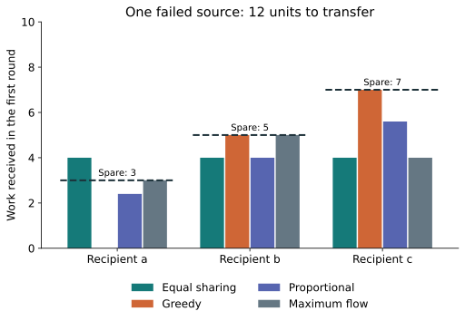
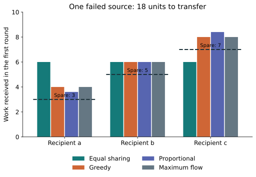
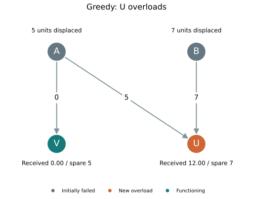
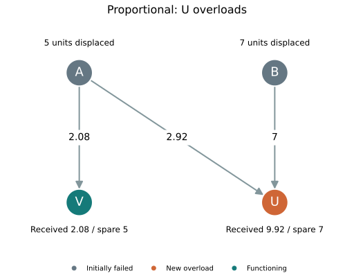
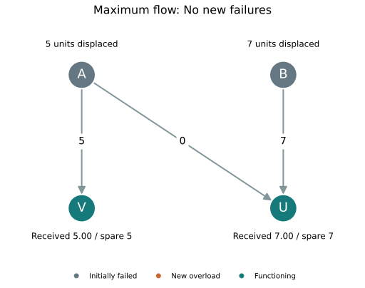

Tutorial 4: Cascading Failures
=========================================

A cascade begins with an initial component failure and continues when the
resulting change in load overloads additional components. The appropriate TIGER
model depends on how load moves after the trigger.

- ``motter_lai`` recomputes global shortest-path load and removes overloaded nodes.
- ``crucitti`` reroutes over most-efficient paths and degrades service through
  congested nodes without removing them.
- ``local_load_sharing`` transfers a failed node's load only to its functioning
  neighbors.

Local load sharing
------------------

By default, the local model follows the degree-weighted redistribution rule of
:cite:`wei2012analysis`. A node starts with load equal to its intact degree and
capacity :math:`(1+r)L_i(0)`. When it fails, a neighboring node :math:`j`
receives

.. math::

   \Delta L_{i\rightarrow j}
   =
   L_i
   \frac{k_j^\beta}
   {\sum_{u\in N_i^+} k_u^\beta}.

With ``beta=0``, every functioning neighbor receives the same share. With
``beta=1``, a neighbor of degree 3 receives three times as much as a neighbor
of degree 1. Larger values concentrate the failed load more strongly on
high-degree neighbors.

The following simulation attacks one high-degree node and applies linear
degree preference:

.. code-block:: python
   :name: local-load-sharing

   from graph_tiger.cascading import Cascading
   from graph_tiger.graphs import graph_loader

   graph = graph_loader('electrical')
   cascade = Cascading(
       graph,
       model='local_load_sharing',
       beta=1,
       r=0.2,
       attack='id_node',
       k_a=1,
       defense=None,
       k_d=0,
       runs=1,
       steps=20,
       seed=7,
       plot_transition=False,
       gif_animation=False
   )

   trajectory = cascade.run_single_sim()
   failed_by_step = [cascade.sim_info[t]['failed']
                     for t in range(len(trajectory))]
   lost_by_step = [cascade.sim_info[t]['lost_load']
                   for t in range(len(trajectory))]

Comparing equal and preferential sharing
------------------------------------------

Keep the graph, attack, capacity margin, and seed fixed, then change only
``beta``:

.. code-block:: python
   :name: compare-local-sharing

   results = {}
   for beta in [0, 1, 2]:
       cascade = Cascading(
           graph, model='local_load_sharing', beta=beta, r=0.2,
           attack='id_node', k_a=1, defense=None, k_d=0,
           runs=1, steps=20, seed=7,
           plot_transition=False, gif_animation=False
       )
       cascade.run_single_sim()
       results[beta] = cascade.sim_info[20]['failed']

This comparison isolates the allocation rule. It does not assume that larger
``beta`` is always safer: concentrating load on hubs can prevent low-degree
neighbors from failing, but it can also overload an already stressed hub.

State and interpretation
------------------------

The attacked state is recorded at index 0, followed by one state for each
requested transition. ``failed`` gives the cumulative number of failed nodes.
``status`` records node loads, and ``lost_load`` records load from failed nodes
that had no functioning neighbor. This is damage-induced lost service, not
deliberate shedding. ``shed_load`` remains an alias for older code. The input
graph is not modified. ``run_single_sim()`` leaves that realization available
for inspection; ``run_simulation()`` resets after every run, including the last.

.. _local-allocation-policies:

Allocating by remaining capacity
--------------------------------------------------------------------------------

Degree can be a poor proxy for the ability to accept more work. Set
``allocation`` to ``greedy``, ``proportional``, or ``max_flow`` to use recipient
headroom instead. The default remains ``degree``, with ``beta`` controlling
only that policy. All four policies transfer the entire failed workload when
at least one functioning recipient exists; capacity is an overload threshold,
not a limit that truncates the completed transfer.

For a failed source with displaced load :math:`d`, let :math:`q` be the number
of eligible neighbors. Compute each neighbor's spare capacity from its load
before the current round:

.. math::

   s_j=\max(0,C_j-L_j), \qquad S=\sum_{j\in N_i^+}s_j.

Greedy allocation visits neighbors in decreasing :math:`s_j`, breaking ties
by original graph node insertion order. Starting with :math:`u=d`, assign
:math:`y_j=\min(u,s_j)` and subtract that amount from :math:`u`. After the
first pass, divide any remainder equally:

.. math::

   x_j=y_j+\frac{u}{q}, \qquad u=\max(0,d-S).

Proportional allocation assigns the full load in proportion to headroom:

.. math::

   x_j=\begin{cases}d\,s_j/S,&S>0,\\d/q,&S=0.\end{cases}

Both policies calculate their allocations independently for each failed source,
using the same pre-round recipient loads. Only after all incoming transfers
have accumulated do overloaded nodes fail. Shared recipients can therefore
receive more than their headroom even when each source's individual allocation
appears to fit. If no recipient exists, add the source workload to ``lost_load``.

Coordinating a round with maximum flow
~~~~~~~~~~~~~~~~~~~~~~~~~~~~~~~~~~~~~~~~~~~~~~~~~~~~~~~~~~~~~~~~~~~~~~~~~~~~~~~~

``allocation='max_flow'`` uses one auxiliary directed network for the round:

1. A super-source connects to each failed-source copy with capacity :math:`d_i`.
2. Each failed-source copy connects to its eligible recipient copies with
   capacity :math:`d_i` on each arc.
3. A single copy of each recipient connects to the super-sink with capacity
   :math:`s_j`. This shared arc prevents headroom from being counted twice.

TIGER uses NetworkX's Edmonds-Karp solver and original graph node insertion
order to construct the auxiliary network. Its flow :math:`f_{ij}` maximizes
the total first-pass work placed within shared headroom. Any leftover work
must still move:

.. math::

   u_i=d_i-\sum_j f_{ij},\qquad
   \Delta L_{i\rightarrow j}=f_{ij}+\frac{u_i}{|N_i^+|}.

These are local handoffs, not multi-hop routes through the physical network.
The overflow rule is an explicit modeling choice. Maximum flow does not promise
the fewest later failures; different tied flows can generate different later
cascades. Record the graph's insertion order and NetworkX version when
reproducing ties. See the `Edmonds-Karp implementation
<https://networkx.org/documentation/stable/reference/algorithms/generated/networkx.algorithms.flow.edmonds_karp.html>`_.

Supplying application workloads
~~~~~~~~~~~~~~~~~~~~~~~~~~~~~~~~~~~~~~~~~~~~~~~~~~~~~~~~~~~~~~~~~~~~~~~~~~~~~~~~

``initial_load`` and ``capacities`` are dictionaries covering every graph node.
Values must be finite and nonnegative. Omit ``initial_load`` to use intact
degrees; omit ``capacities`` to use :math:`(1+r)L_i(0)`. Explicit capacities
are used directly, without another multiplier. Inputs are copied and restored
on reset. Node defenses can still increase selected capacities.

``initial_failures`` supplies an exact initial failed set instead of selecting
an attack; an empty list disables the initiating attack. These supplied inputs
apply only to ``local_load_sharing``. ``last_transfers[(i,j)]`` gives the latest
round's completed handoff, including overflow. ``lost_load`` reports unserved
work with no recipient, and is not a deliberate shedding control.

One source: fitting headroom versus causing overload
~~~~~~~~~~~~~~~~~~~~~~~~~~~~~~~~~~~~~~~~~~~~~~~~~~~~~~~~~~~~~~~~~~~~~~~~~~~~~~~~

Node F can hand work to a, b, and c. Recipients start empty and have capacities
3, 5, and 7. Compare 12 and 18 displaced units under identical conditions.
Both examples below use these imports:

.. code-block:: python

   import networkx as nx
   from graph_tiger.cascading import Cascading

.. literalinclude:: ../../../experiments/cascading/local_allocation.py
   :language: python
   :start-after: # DOC-BEGIN single
   :end-before: # DOC-END
   :dedent: 4

   Dashed lines mark headroom. Equal sharing overloads a despite sufficient
   total capacity. Greedy assigns (0,5,7), proportional (2.4,4,5.6), and this
   fixed-order maximum flow (3,5,4); those three fit.

   Greedy and maximum flow assign (4,6,8); proportional assigns (3.6,6,8.4).
   All three recipients overload. Equal sharing assigns (6,6,6), initially
   overloading only a and b. Maximizing first-pass fit does not necessarily
   minimize the number of failures after overflow.

Two sources: shared capacity requires coordination
~~~~~~~~~~~~~~~~~~~~~~~~~~~~~~~~~~~~~~~~~~~~~~~~~~~~~~~~~~~~~~~~~~~~~~~~~~~~~~~~

A has 5 displaced units and can use U or V; B has 7 and can use only U. Their
spare capacities are 7 and 5. All panels use identical positions and initial
failures. Gray nodes failed initially, orange means a new overload, and teal
means functioning. Arrow labels give the work transferred in one round.

.. literalinclude:: ../../../experiments/cascading/local_allocation.py
   :language: python
   :start-after: # DOC-BEGIN shared
   :end-before: # DOC-END
   :dedent: 4

   Equal sharing splits A's work, but B must send everything to U.

   Greedy allocates each source independently using pre-round headroom.

   Proportional sharing uses both recipients but still overloads U.

   Coordinated allocation fits all 12 units. If B instead carries 9 units,
   its extra two units must also reach U and cause overload. No work is shed.

Download the :download:`transfer data <../_static/local-allocation/local-allocation.csv>`
and :download:`settings <../_static/local-allocation/local-allocation.json>`.
Run ``python -m experiments.cascading.local_allocation --output-dir results``
from the repository root to regenerate the figures and observations. These
small experiments isolate allocation mechanics, not universal policy rankings.
