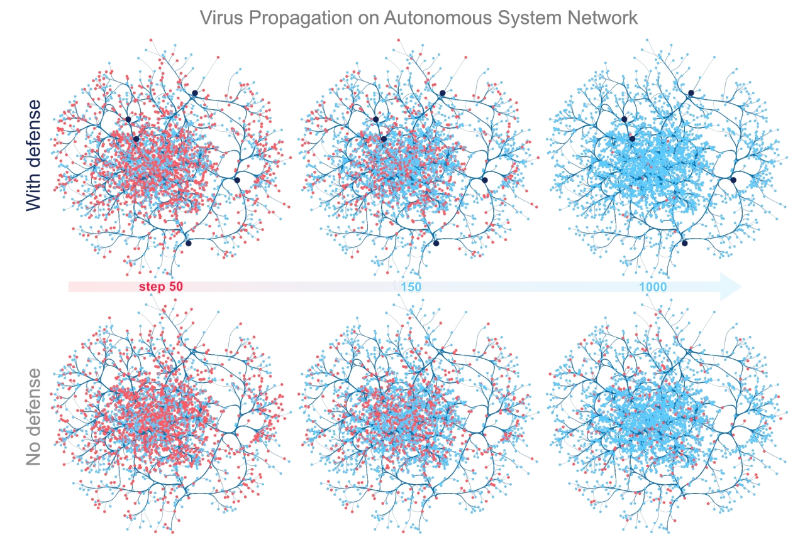

Tutorial 5: Entity Dissemination
================================

A critical concept in entity dissemination is *network diffusion*, which attempts to capture the underlying mechanism enabling network propagation. In order to augment this diffusion process, TIGER leverages the defense techniques in the previous tutorial for use with two prominent diffusion models: the flu-like susceptible-infected-susceptible (SIS) model, and the vaccinated-like susceptible-infected-recovered (SIR) model. For example, to *minimize* the ability of viruses to spread we can monitor (remove) nodes in the graph to reduce graph connectivity. On the other hand, if want to *maximize* network diffusion e.g., marketing campaign, we can use defense techniques like edge rewiring or addition to increase graph connectivity. Below, we highlight the SIS infectious disease model and how TIGER's defense techniques can help contain a simulated outbreak.

   Visualizing a computer virus simulation that follows the SIS infection model (effective strength $s=3.21$) on the *Oregon-1 Autonomous System* network. Top: defending only 5 nodes with *Netshield*, the number of infected entities is reduced to nearly zero. Bottom: without any defense, the virus remains endemic.

Each node in the SIS model can be in one of two states, infected *I* or susceptible *S*.  At each time step *t*, an infected node *v* has a probability :math:`\beta` of infecting each of it's uninfected neighbors :math:`u\in N(v)`. After this, each infected node *v* has a probability :math:`\delta` of healing and becoming susceptible again. The relationship between the birth rate :math:`\beta`, death rate :math:`\delta` and the spectral radius :math:`\lambda_1` of the graph has been a widely studied topic. It's been shown that the spectral radius of a graph is closely tied to the epidemic threshold :math:`\tau` of a network in an SIS model. In particular, :math:`\frac{\beta}{\delta} < \tau=\frac{1}{\lambda_{1}}`. This means for a given virus strength *s*, an epidemic is more likely to occur on a graph with larger :math:`\lambda_1`. As such, we say that a virus has an effective strength :math:`s = \lambda_1 \cdot b / d`, where a larger *s* means a stronger virus.

Now that we have a little background, lets dive into the code required to set up the simulation and create the above visualization. 

.. code-block:: python
   :name: sis-simulation

   from graph_tiger.diffusion import Diffusion
   from graph_tiger.graphs import graph_loader

   graph = graph_loader('as_733')

   sis_params = {
      'model': 'SIS',
      'b': 0.00208,
      'd': 0.01,
      'c': 1,

      'runs': 1,
      'steps': 5000,

      'diffusion': 'min',
      'method': 'ns_node',
      'k': 5,

      'plot_transition': True,
      'gif_animation': False,

      'edge_style': 'bundled',
      'node_style': 'force_atlas',
      'fa_iter': 20
   }

   diffusion = Diffusion(graph, **sis_params)
   results = diffusion.run_simulation()

   diffusion.plot_results(results)

To assist users in summarizing simulation results over many configurations, we enable them to create plots like the figure below, which show results for 5 SIS effective virus strengths :math:`s = \{0, 3.21, 6.42, 9.63, 12.84\}` over a period of 5000 steps. 

.. figure:: ../../../images/sis-vaccination.jpg
   :width: 100 %
   :align: center

   SIS simulation with 5 virus strengths on the Oregon-1 Autonomous System network. No defense (left), Netshield defense (right).

Running multiple simulations for comparison only takes a few lines of code:

.. code-block:: python
   :name: sis-comparison

   import os
   import numpy as np
   import matplotlib.pyplot as plt
   from collections import defaultdict

   from graph_tiger.diffusion import Diffusion

   # baseline
   sis_params = {
        'model': 'SIS',
        'b': 0.00208,
        'd': 0.01,
        'c': 1,
        'runs': 1,
        'steps': 5000,

        'robust_measure': 'largest_connected_component',

        'k': 15,
        'diffusion': None,
        'method': None,

        'plot_transition': False,
        'gif_animation': False,
        'seed': 1,

        'edge_style': 'bundled',
        'node_style': 'force_atlas',
        'fa_iter': 20
    }
    
   run_epidemic_experiment(sis_params)

   # decrease diffusion
   sis_params = {
        'model': 'SIS',
        'b': 0.00208,
        'd': 0.01,
        'c': 1,
        'runs': 10,
        'steps': 5000,

        'robust_measure': 'largest_connected_component',

        'k': 5,
        'diffusion': 'min',
        'method': 'ns_node',

        'plot_transition': False,
        'gif_animation': False,
        'seed': 1,

        'edge_style': 'bundled',
        'node_style': 'force_atlas',
        'fa_iter': 20
   }

   run_epidemic_experiment(sis_params)

.. code-block:: python
   :name: sis-comparison-2

   def plot_results(graph, params, results):
      plt.figure(figsize=(6.4, 4.8))

      title = '{}_epidemic:diffusion={},method={},k={}'.format(params['model'], params['diffusion'],
                                                                          params['method'], params['k'])

      for strength, result in results.items():
         result_norm = [r / len(graph) for r in result]
         plt.plot(result_norm, label="Effective strength: {}".format(strength))

      plt.xlabel('Steps')
      plt.ylabel('Infected Nodes')
      plt.legend()
      plt.yscale('log')
      plt.ylim(0.001, 1)
      plt.title(title)

      save_dir = os.getcwd() + '/plots/' + title + '/'
      os.makedirs(save_dir, exist_ok=True)

      plt.savefig(save_dir + title + '.pdf')
      plt.show()
      plt.clf()

   def run_epidemic_experiment(params):
      graph = as_733().copy()
      results = defaultdict(list)

      b_list = np.arange(0, 0.005, 0.001)  # transmission probability
      for idx, b in enumerate(b_list):
         params['b'] = b

         if idx == 1:
            params['plot_transition'] = True
            params['gif_animation'] = True
            params['gif_snaps'] = True
         else:
            params['plot_transition'] = False
            params['gif_animation'] = False
            params['gif_snaps'] = False

         ds = Diffusion(graph, **params)

         result = ds.run_simulation()
         results[ds.get_effective_strength()] = result

      plot_results(graph, params, results)

